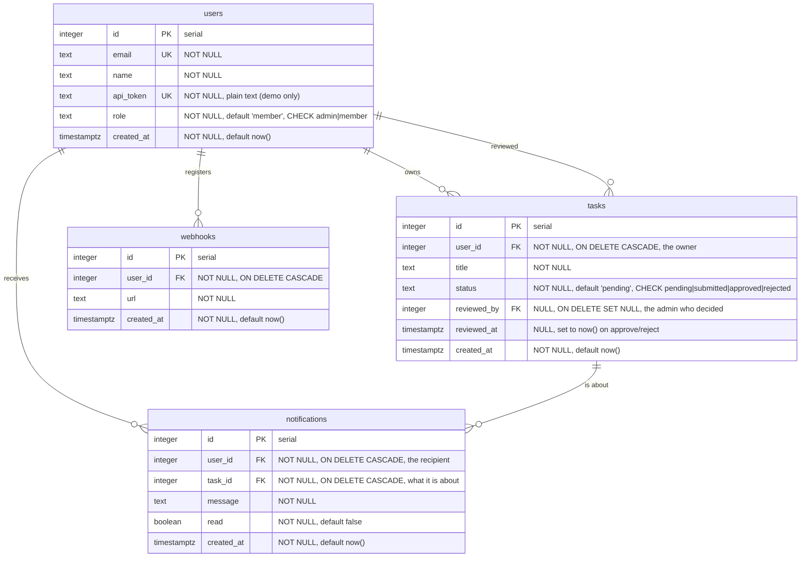

# Database ERD

Generated from the live database (`information_schema` + `pg_constraint` +
`pg_indexes`), not from the source files, so it reflects what Postgres actually
holds. Matches `initdb/schema.sql`.

## Diagram



Every relationship is one-to-many (`||--o{`): one user has many tasks, and a
task belongs to exactly one user. `notifications` is the only table with two
parents, because a notification is always *someone* being told about *something*.

## Constraints

| Table | Constraint | Definition |
| --- | --- | --- |
| users | `users_pkey` | PRIMARY KEY (id) |
| users | `users_email_key` | UNIQUE (email) |
| users | `users_api_token_key` | UNIQUE (api_token) |
| users | `users_role_check` | CHECK (role IN ('admin','member')) |
| tasks | `tasks_pkey` | PRIMARY KEY (id) |
| tasks | `tasks_user_id_fkey` | FK → users(id) **ON DELETE CASCADE** |
| tasks | `tasks_reviewed_by_fkey` | FK → users(id) **ON DELETE SET NULL** |
| tasks | `tasks_status_check` | CHECK (status IN ('pending','submitted','approved','rejected')) |
| tasks | `tasks_review_consistent` | CHECK (reviewed columns set only for approved/rejected) |
| webhooks | `webhooks_pkey` | PRIMARY KEY (id) |
| webhooks | `webhooks_user_id_fkey` | FK → users(id) ON DELETE CASCADE |
| notifications | `notifications_pkey` | PRIMARY KEY (id) |
| notifications | `notifications_user_id_fkey` | FK → users(id) ON DELETE CASCADE |
| notifications | `notifications_task_id_fkey` | FK → tasks(id) ON DELETE CASCADE |

**The CHECK constraints are the point.** `role` and `status` are the two columns
whose values the application reasons about, so the database refuses anything
outside the allowed set. Validation in Go protects the API; a CHECK protects the
data from *any* client, including a stray `psql` session.

`tasks_review_consistent` goes further: it encodes the *state machine* as a
constraint, so a task cannot be `pending` while still carrying a reviewer.
Verified by trying to break it directly in SQL:

```text
UPDATE tasks SET status='pending' WHERE id=36;
ERROR:  new row for relation "tasks" violates check constraint "tasks_review_consistent"
```

**Two FKs to `users`, two different delete rules — and that difference matters.**

| Column | On user delete | Why |
| --- | --- | --- |
| `tasks.user_id` | **CASCADE** | The task belongs to its owner; without them it is meaningless. |
| `tasks.reviewed_by` | **SET NULL** | The task belongs to the *member*, not the reviewer. Deleting an admin must not destroy work they happened to approve. |

So `DELETE FROM users` where that user is an owner removes their tasks,
webhooks, and notifications. Where they are only a *reviewer*, the task
survives with `reviewed_by` set to NULL and `reviewed_at` intact — you keep the
knowledge that it was reviewed, and lose only who did it.

**Cascade chain.** Deleting a user removes their tasks, webhooks, and
notifications; deleting a task removes the notifications about it. So
`DELETE FROM users WHERE id = 2` can remove rows from all four tables, and no
Go code runs.

## Indexes

| Table | Index | Columns | Why |
| --- | --- | --- | --- |
| users | `users_pkey` | id | primary key |
| users | `users_email_key` | email | UNIQUE, and the signup conflict check |
| users | `users_api_token_key` | api_token | UNIQUE, and **every authenticated request looks a token up here** |
| tasks | `tasks_pkey` | id | primary key |
| tasks | `tasks_user_id_idx` | user_id | every member query filters on it |
| tasks | `tasks_status_idx` | status | the admin review queue filters on it |
| webhooks | `webhooks_user_id_idx` | user_id | delivery looks up a user's hooks |
| notifications | `notifications_user_idx` | (user_id, read) | listing is "my notifications, unread first" |

`notifications_user_idx` is **composite** and the column order matters: it serves
`WHERE user_id = $1` and `WHERE user_id = $1 AND read = false`, but not a query
filtering on `read` alone. Leftmost-prefix rule.

## What is deliberately missing

- **No `updated_at`.** Nothing in the API reports when a row last changed.
- **No soft deletes.** `DELETE` is real, which is why the cascades matter.
- **Tokens are plain text.** A real system stores a hash, so a database leak
  does not hand over working credentials. Kept plain here because the project
  has no signup-then-login flow to re-issue them.
- **The audit trail is shallow.** `reviewed_by` / `reviewed_at` record only the
  *most recent* decision, and a resubmission clears them. There is no history
  table, so "rejected twice, then approved" is not recoverable. A real audit log
  would be append-only rows rather than columns that get overwritten.
- **No reviewer identity after deletion.** `ON DELETE SET NULL` keeps the task
  and the timestamp but loses who decided. That is the deliberate trade: an
  audit log with its own copy of the reviewer's name would survive.

## Regenerating this

```powershell
docker exec -i taskdb psql -U taskuser -d tasks -c "\d+ users" -c "\d+ tasks" -c "\d+ webhooks" -c "\d+ notifications"
```
